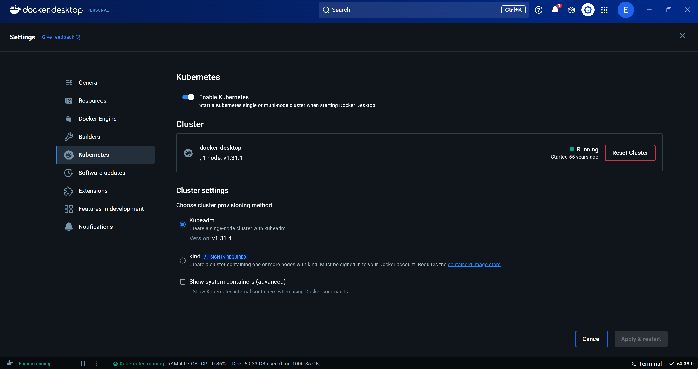

# Workshop Mão na Massa Introdução ao Kubernetes para DEV

**Pré Requisitos:**

**1. Instalação e configuração do Docker Desktop**
- Windows 11: https://www.docker.com/products/docker-desktop
- Ubuntu Jellyfish 22.04 (LTS): https://docs.docker.com/desktop/install/ubuntu/
- MacOS: https://docs.docker.com/desktop/install/mac-install/

**3. Instalar o kubectl**
- Windows: choco install kubernetes-cli. É necessário ter o chocolatey instalado. Caso não tenha instalado: https://chocolatey.org/install. Realizar a instalação via Windows Terminal com permissão de Administrador. 
- Ubuntu https://kubernetes.io/docs/tasks/tools/install-kubectl-linux/#install-using-native-package-management
- MacOS: https://kubernetes.io/docs/tasks/tools/install-kubectl-macos/#install-with-homebrew-on-macos

**4. Habilitar o Kubernetes no Docker Desktop**
- Ir em Configurações no Docker Desktop -> Kubernetes -> Enable Kubernetes


**5. Teste do Kubernetes**
- Abrir um terminal e executar o seguinte comando: kubectl get nodes. Deverá aparecer a seguinte saída:
  
```
NAME             STATUS   ROLES           AGE   VERSION
docker-desktop   Ready    control-plane   23h   v1.31.4
```

**6. Durante o workshop será utiliza o VSCode**
- https://code.visualstudio.com/


**Opcional instalar o Windows Subsystem For Linux (WSL) e utilizar este integrado com o Docker Desktop**
- Com esta configuração vc terá um ambiente Linux rodando no Windows
- Instalar o Windows Subsystem for Linux (WSL): https://learn.microsoft.com/en-us/windows/wsl/install
- Instalar a distro do Ubuntu: https://documentation.ubuntu.com/wsl/en/latest/howto/install-ubuntu-wsl2/
- Ir em Configurações no Docker Desktop -> Kubernetes -> WSL Integration
-  

